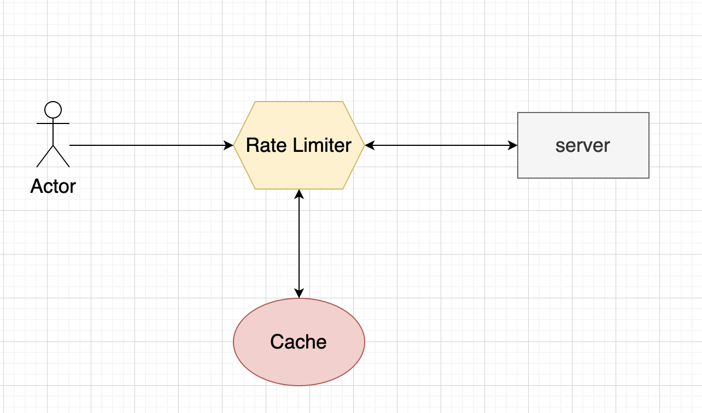
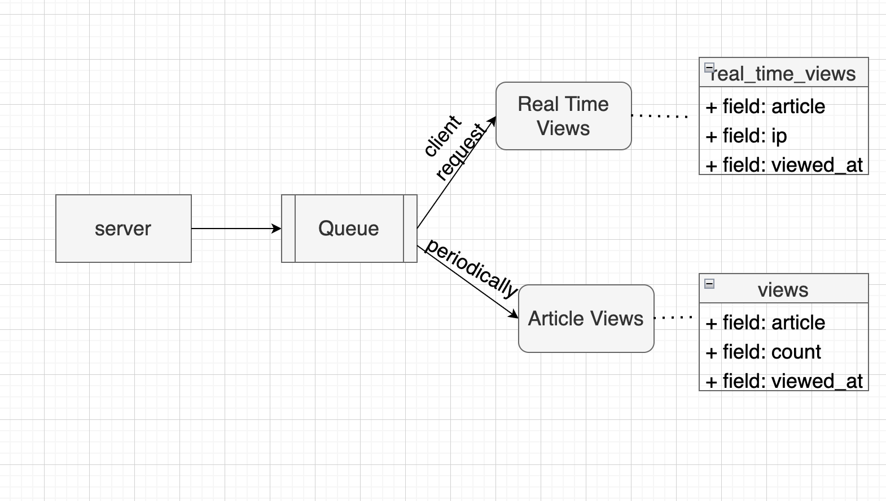
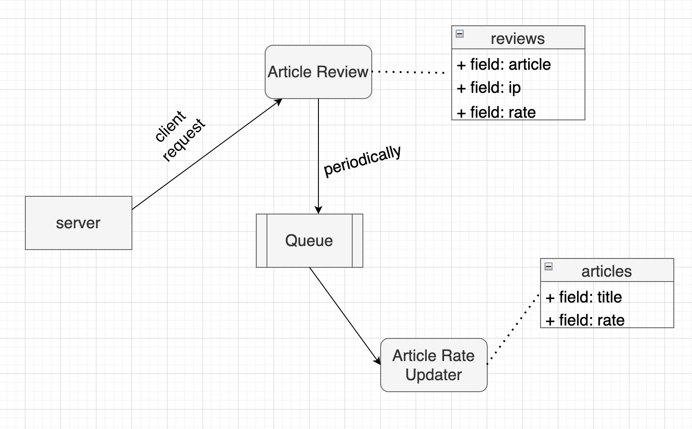

## About Project

a knowledge center where articles can be published, read and rated by users (identified by IP address). Articles can be given categories.

- Article ( title, body, creation date, categories, views, rates )
- Categories ( name )
- Reviews (article, rate)
- Views (article, date, count)
- Real Time Views (ip, article, date)


## Project Features

- List all Articles with filter query
- Store articles with categories
- Rate to articles
- Calculate Rates Ranking based on bayes algorithm
- A user (an IP address) may only rate once to an article and only 10 times total in the last day

## Code Architecture
- Services (use cases) : app/Services
- Service Provider (dependency injection) : all services depends on abstraction and inject in AppServiceProvider 
- Rate Limiter :  app/Providers/RouteServiceProvider.php
- Pipeline Request Query : app/Query 
- Job Queues: app/Jobs
- Database Seeds: database/seeders/DatabaseSeeder.php
- E2E Test (behat) : features/
- Feature Test : test/Feature

## System Design
### Rate Limiter
- A limit is applied on the number of requests allowed for a user in a given period of time

  
### Views
- Each showing the article insert in real time views 
- The views count for each article calculate based on real time views with daily cron job

  
### Rates
- The ip reviews for each article store in DB
- the daily cron job calculate the rate ranking Based on Bayesian Algorithm:
```weighted rank (WR) = (v ÷ (v+m)) × R + (m ÷ (v+m)) × C
 where:
  R = average review for the article = (mean_review)
  v = number of review for the article = (sum_review)
  m = minimum num of review required to be listed in the analysis
  C = the average review across the whole report
  ```


### Count Article Views Once Per Ip 

### Limit Reviews Per Day


#### Run Project

``` php artisan serve ```

#### Run Migration

``` php artisan migrate ```

#### Run Seed

``` php artisan db:seed ```

### Open Api Documentation (scribe)
- See this route ```/docs```
- Check the open api file ```public/docs/openapi.yaml```
